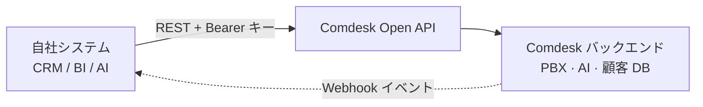

**Comdesk Lead Open API** を使うと、アプリケーションから Comdesk と直接やり取りできます。CRM・BI・チャット・AI ツールを開発する場合、通話履歴の取得（AI による文字起こし・要約を含む）、顧客の一括登録、集計済みの通話統計の取得、リアルタイムな Webhook イベントの購読が可能です。すべて、API キーとスコープで保護された標準的な REST インターフェースで提供されます。

このドキュメントは、外部システムを Comdesk テナントに**連携する開発者**向けです。管理画面から API キーを発行・管理する方法については、ビジネス向けガイドブックを参照してください。

## できること

<CardGroup cols={2}>
  <Card title="通話履歴の同期" icon="clock-rotate-left">
    完了した通話を取得 — メタデータ、メモ、文字起こし、AI 要約、音声分析、録音 URL。
  </Card>

  <Card title="顧客インポート" icon="users">
    顧客を 1 件ずつ、または最大 500 件まで非同期で一括登録。`external_id` で相互参照できます。
  </Card>

  <Card title="レポートと BI" icon="chart-line">
    Power BI・Tableau・Looker 向けに集計済みの通話統計を取得します。
  </Card>

  <Card title="リアルタイムイベント" icon="bell">
    通話の終了、顧客の変更、AI 処理の完了時に署名付き Webhook を受信します。
  </Card>
</CardGroup>

<Note>
  クリックして発信（`POST /calls/initiate`）と IVR トリガー（`POST /ivr/trigger`）は、現在のリリースでは**提供されていません**。フェーズ 2 で提供予定です。
</Note>

## 仕組み



すべてのリクエストは API キーで認証され、テナントのライセンスとそのキーに付与された**スコープ**で権限を確認し、テナント単位でレート制限を適用し、相関 ID `X-Request-ID` とともに記録されます。Comdesk は署名付き Webhook でイベントをあなたのエンドポイントに送信します。

## 前提条件

- `open_api` ライセンスを持つ Comdesk Lead テナント（Webhook とレポートには `open_api_advanced` も必要）。
- テナント管理者が発行した API キー（[認証](/developer/open-api/authentication) を参照）。
- Webhook を使う場合：`POST` リクエストを受信できる、外部から到達可能な **HTTPS** エンドポイント。

<Note>
  Webhook とレポート API は **`open_api_advanced`** ライセンスが必要です。ライセンスがない場合、これらのエンドポイントは `403 license_required` を返します。プラン比較は [レート制限とクォータ](/developer/open-api/rate) を参照してください。
</Note>

## ベース URL

Comdesk は環境ごとに専用のドメインで稼働しています。すべての v1 エンドポイントは、Comdesk へのログインに使用しているのと同じドメイン配下で提供されます：

```text
https://xxxx.comdesk.com/api/v1
```

## 次のステップ

<CardGroup cols={2}>
  <Card title="クイックスタート" icon="rocket" href="/developer/open-api/quickstart">
    5 分で最初の認証付きリクエストを実行します。
  </Card>

  <Card title="認証" icon="key" href="/developer/open-api/authentication">
    API キーの形式、Bearer ヘッダー、スコープ、IP・オリジン許可リスト。
  </Card>

  <Card title="API リファレンス" icon="code" href="/developer/open-api/api-reference/call">
    すべてのエンドポイント、パラメータ、レスポンスフィールド。
  </Card>

  <Card title="Webhook" icon="bell" href="/developer/open-api/webhook">
    イベントを購読し、署名を検証します。
  </Card>
</CardGroup>
