Comdesk LeadとSalesforceを連携することで、Comdesk Leadの通話履歴をSalesforceの「ToDo（活動）」として自動的に連携できます。

本マニュアルでは、Salesforce側の接続アプリケーション作成から、Comdesk Lead側の連携設定（5ステップ）、連携テスト・開始までの手順を説明します。

## インテグレーション管理画面を開く

1. Manageメニューから「インテグレーション管理」を選択します。
2. インテグレーション管理画面では、Salesforce・HubSpot・Kintoneのメニューについてそれぞれ設定できます。

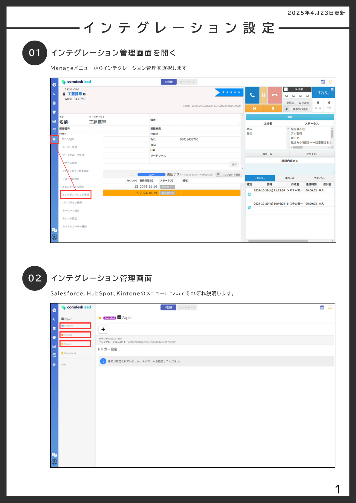

## 事前準備：SalesforceにComDesk Lead用の連携アプリを作成

### 接続アプリケーションを作成する

Salesforceの「設定」→「アプリケーションマネージャー」→「新規接続アプリケーション」を選択します。

表示されるダイアログで「接続アプリケーションを作成」を選択し、「続行」を押します。

### 接続アプリケーションの設定内容

接続アプリケーションの設定内容は以下の通りです。

| 項目名 | 設定内容 |
| --- | --- |
| 接続アプリケーション名 | Comdesk Lead CRM Connector |
| API参照名（自動取得） | Comdesk Lead CRM Connector |
| 取引先責任者メール | 責任ご担当者様のメールアドレス |
| OAuth設定の有効化 | TRUE |
| デバイスフローを有効化 | TRUE |
| コールバックURL | `https://pl-crmconnector.comdesk.com/salesforce/auth/callback` |
| 選択したOAuth範囲 | ・APIを利用してユーザーデータを管理（api） ・Data Cloudでセグメンテーションを実行（cdp_segment_api） ・Data Cloudデータに対してANSI SQLクエリを実行（cdp_query_api） ・コンテンツリソースにアクセス（content） ・WEBブラウザーを通じてユーザーデータを管理（web） ・いつでも要求を実行（refresh_token、offline_access） ・ID、プロファイル、メール、住所、電話アドレスにアクセス（id、profile、email、address、phone） |
| サポートされる認証フローにProof Key for Code Exchange（PKCE）を要求 | FALSE |
| Webサーバーフローの秘密が必要 | TRUE |
| 更新トークンフローの秘密が必要 | TRUE |
| クライアントログイン情報フローを有効化 | TRUE |
| 認証コードおよびログイン情報フローを有効化 | TRUE |

設定後、「次へ」を押して保存します。

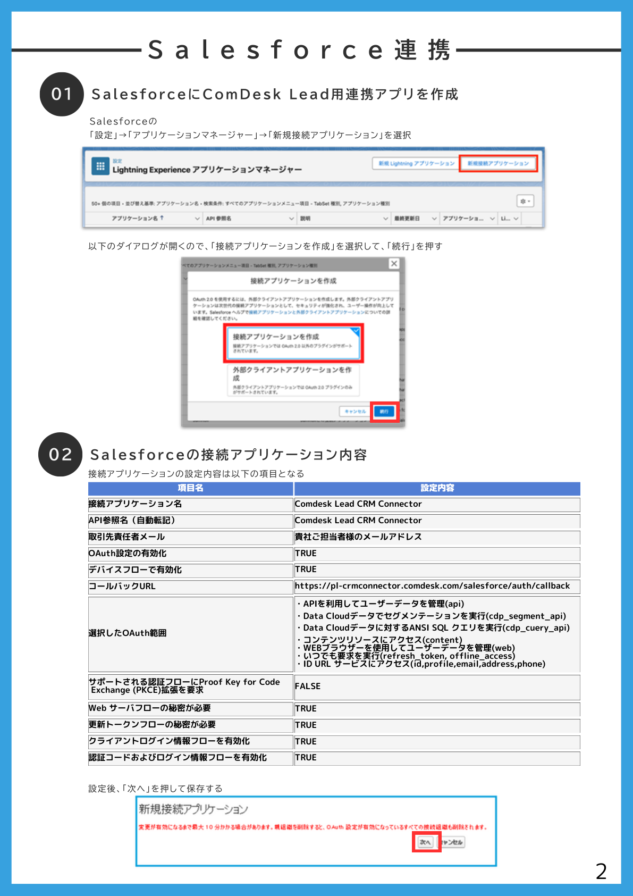

## Salesforce連携設定を開く

### Salesforce連携設定画面を開く

インテグレーション管理画面で「Salesforce」を選択します。

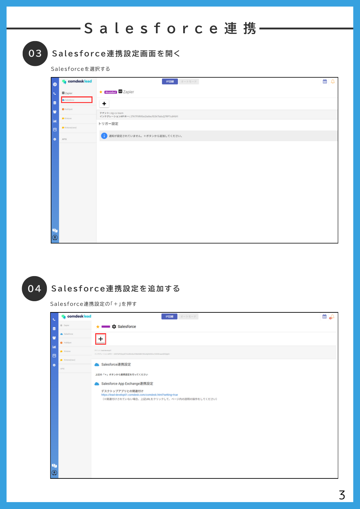

### Salesforce連携設定を追加する

Salesforce連携設定の「＋」を押します。

## STEP1 - アカウント情報の登録

Salesforceのアカウント情報を入力し、「設定する」を押します。

入力する項目は以下の3つです。

- **Client Id（コンシューマ鍵）**
- **Client Secret（コンシューマの秘密）**
- **Subdomain（サブドメイン）**

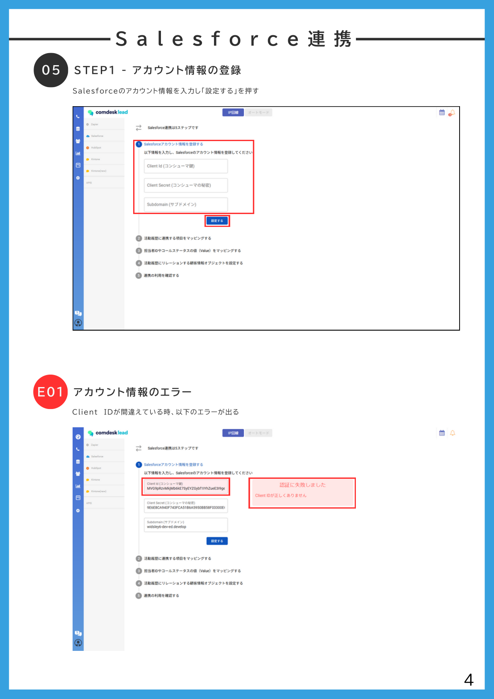

### アカウント情報のエラー

入力内容に誤りがある場合、以下のエラーが表示されます。

- **Client IDのエラー**：Client IDが間違えている時、「認証に失敗しました／Client IDが正しくありません」と表示されます。
- **Client Secretのエラー**：Client Secret（コンシューマの秘密）が間違えている時、「認証に失敗しました／Client Secretが正しくありません」と表示されます。
- **Subdomainのエラー**：Subdomain（サブドメイン）が間違えている時、エラーが表示されます。
- **項目の未入力**：アカウント情報は必須項目のため、入力がないとエラーが表示されます。

### 補足：Salesforceの設定情報（Client Id・Client Secret・Subdomain）の確認方法

1. Salesforceの設定を開き、「アプリケーションマネージャー」を選択します。
2. 作成した接続アプリケーション「Comdesk Lead dev CRM Connector」を選択します。
3. コンシューマーの詳細を管理を選択します。
4. Salesforceの確認コードを入力し、検証を押します。
5. コンシューマー鍵、コンシューマーの秘密をコピーして貼り付けます（Client Id・Client Secret）。
6. サブドメインを入力します。こちらの場合、「XXXXXXXX.develop」を入力します（URLの先頭部分）。
7. 入力した結果、それぞれの項目に値が入ります。

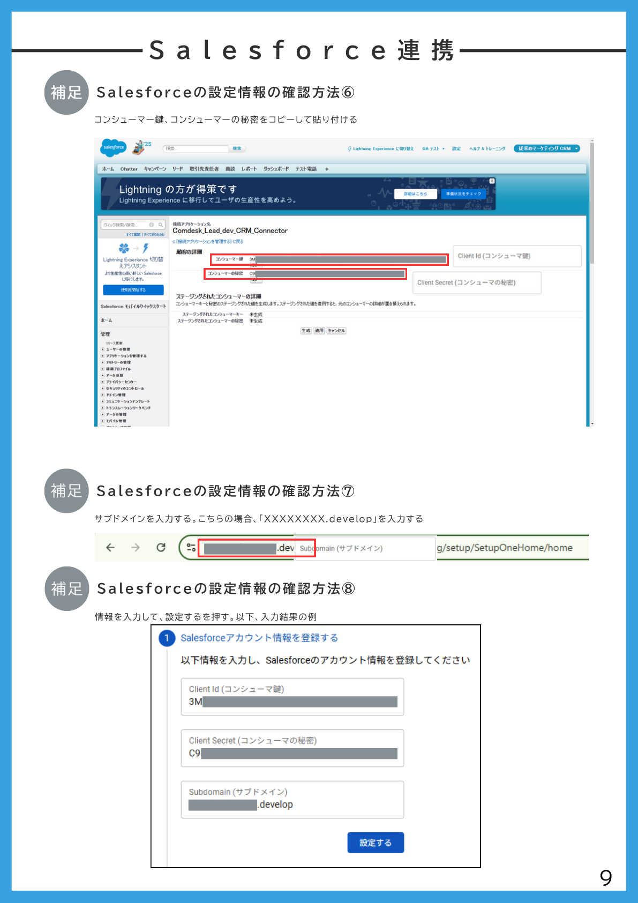

## Salesforceのログイン

### ログインを実施する

Salesforceのログインを実施します。

- 管理用アカウントがある場合は、管理用アカウントでログインを実施します。
- ※Salesforce側のエラーについては割愛します。

### ログイン成功

「次へ」ボタンと、メッセージ「認証に成功しました『次へ』ボタンを押して進んでください」が表示されます。

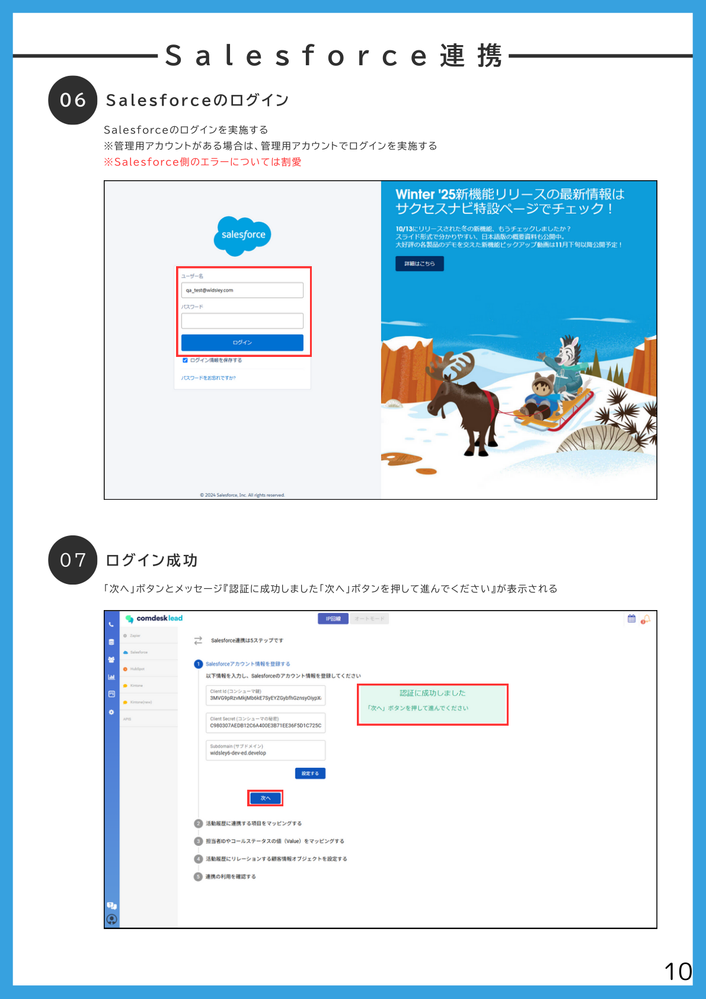

## STEP2 - 活動履歴に連携する項目のマッピング

Comdesk Leadの項目（左）とSalesforceの項目（右）とを紐付けます。「＊」が付いている箇所は必須項目です。完了したら設定ボタンを押します。

> ※設定できるSalesforceのオブジェクトは「ToDo」のみです。

> ※Salesforceの「件名」「説明」の連携内容は、後述の[STEP4 - 件名と説明への連携詳細設定](#step4---件名と説明への連携詳細設定)にて実施します。

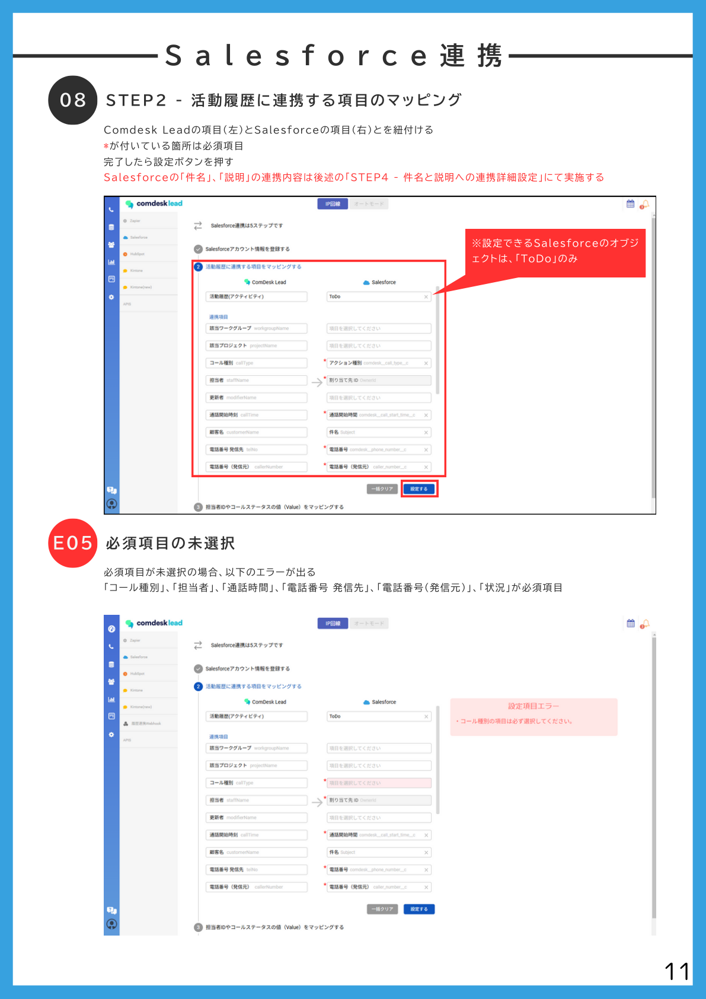

### マッピング時のエラー

- **必須項目の未選択**：必須項目が未選択の場合、エラーが表示されます。「コール種別」「担当者」「通話時間」「電話番号 発信先」「電話番号（発信元）」「状況」が必須項目です。
- **ToDo連携時のロングテキスト項目の複数設定**：ToDo（活動）に、255文字以上のロングテキスト項目を2つ選択しているとエラーが表示されます。ロングテキスト項目は「通話メモ」「録音ファイルのテキスト化データ」「会話内容要約」の3つで、このうち1つしか連携設定はできません。
- **日時項目に日時以外を設定**：通話開始時刻の項目に日時以外の項目を設定すると、エラーが表示されます。
- **文字列項目に文字列以外を設定**：文字列の項目に文字列以外の項目を設定すると、エラーが表示されます。

### 補足：項目マッピングの詳細（ToDoプリセット）

SalesforceのToDoオブジェクトを選択すると、Comdesk Leadの項目プリセットが設定されます。

| Comdesk Lead | Salesforce | 必須 | 備考 |
| --- | --- | --- | --- |
| 該当ワークグループ | ― | | |
| 該当プロジェクト | ― | | |
| コール種別 | アクション種別 | ○ | |
| 担当者 | 割り当て先ID | ○ | 変更不可 |
| 更新者 | ― | | |
| 通話開始時刻 | 通話開始時刻 | | |
| 顧客名 | 件名 | | |
| 電話番号 発信先 | 電話番号 発信先 | ○ | |
| 電話番号（発信元） | 電話番号（発信元） | ○ | |
| 応対者 | 応対者 | | |
| ステータス | 状況 | | |
| 再コールフラグ | ― | | |
| 通話時間 | 通話時間 | | |
| 通話メモ | ― | | |
| 録音ファイルのDL_URL | 録音ファイルのDL URL | | |
| 顧客UUID | ― | | |
| 録音ファイルのテキスト化データ | 説明 | | |

> ※プリセットの設定内容はデータベースに登録されています。データベースの内容更新で変更が可能です。

## STEP3 - ステータスのバリューマッピング設定

Comdesk LeadのステータスをSalesforceのどの項目と紐づけるかを設定します。選択が完了したら「設定する」を押します。

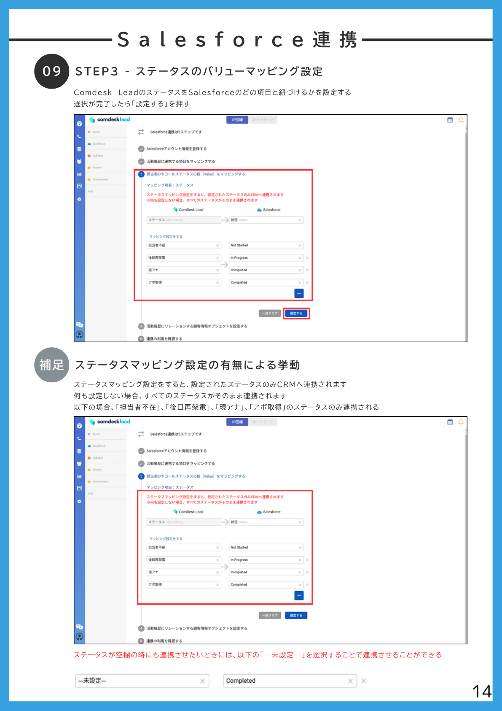

### 補足：ステータスマッピング設定の有無による挙動

- ステータスマッピングを設定すると、設定されたステータスのみCRMへ連携されます。
- 何も設定しない場合、すべてのステータスがそのまま連携されます。
- 例：「担当者不在」「後日再架電」「現ナイ」「アポ取得」のステータスのみ連携される。
- ステータスが空欄や時には未連携にしたいときは、「--未設定--」を選択することで連携させることができます。

## STEP3 - 担当者のバリューマッピング設定

Comdesk Leadの担当者をSalesforceのどの担当者と紐づけるかを設定します。選択が完了したら「設定する」を押します。

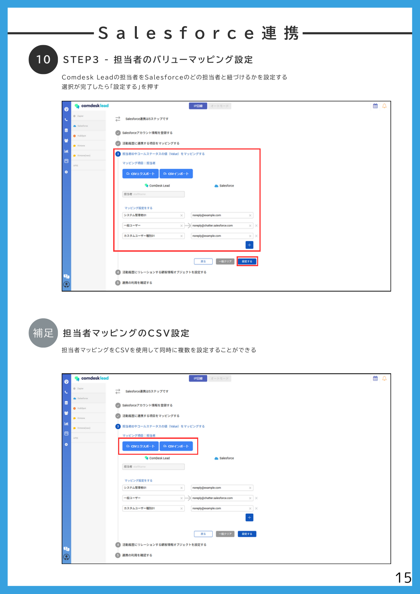

### 補足：担当者マッピングのCSV設定

担当者マッピングはCSVを使用して、同時に複数を設定することができます。

#### CSVエクスポート

「CSVエクスポート」を押すとファイル名「salesforce_staff_value_mapping.csv」というCSVフォーマットがダウンロードされます。

CSVフォーマットについて：

- 一番左に、Comdesk Leadで登録のアカウント名の一覧が表示されます。
- 一番右に、Salesforceに登録されているアカウントの一覧が表示されます。
- 真ん中に、Salesforceユーザー候補を記載することで、Comdesk Leadとのマッピングを設定することができます。

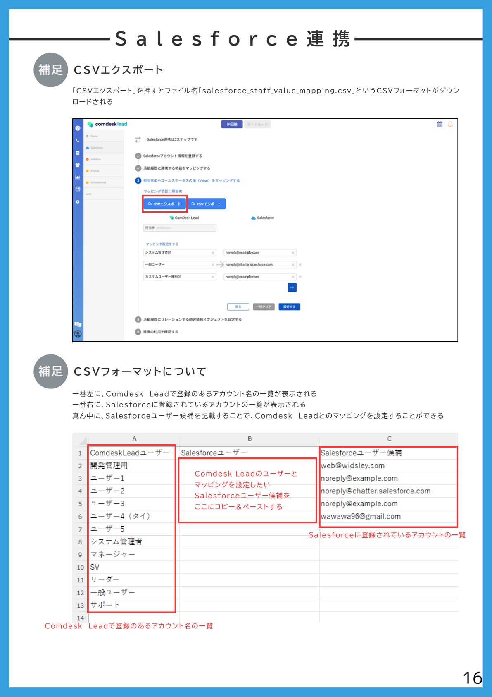

- 既に担当者マッピングが設定済みの場合、設定済みのユーザー情報が入力された状態のCSVがエクスポートされます。
- 該当しないComdesk Leadユーザーは削除します。Salesforceユーザー候補も設定行にないものは削除します。

#### CSVインポート

1. 「CSVインポート」を押すとファイルの取り込みポップアップが開きます。
2. 「ファイルを選択」を押して、ファイルを選択します。
3. ファイルを選択し「開く」を押します。
4. ファイルを選択後、「インポート」を押します。
5. インポート結果に応じて、担当者マッピングの値が設定されます。
6. CSVの内容に誤りがあると、エラーメッセージが出るので、エラーの指摘内容に従ってCSVを修正します。

## STEP4 - 件名と説明への連携詳細設定

件名と説明に、自由入力のテキストと既存のComdesk Leadのデータ項目を設定し連携させることができます。

> ※2025/3/12リリース予定

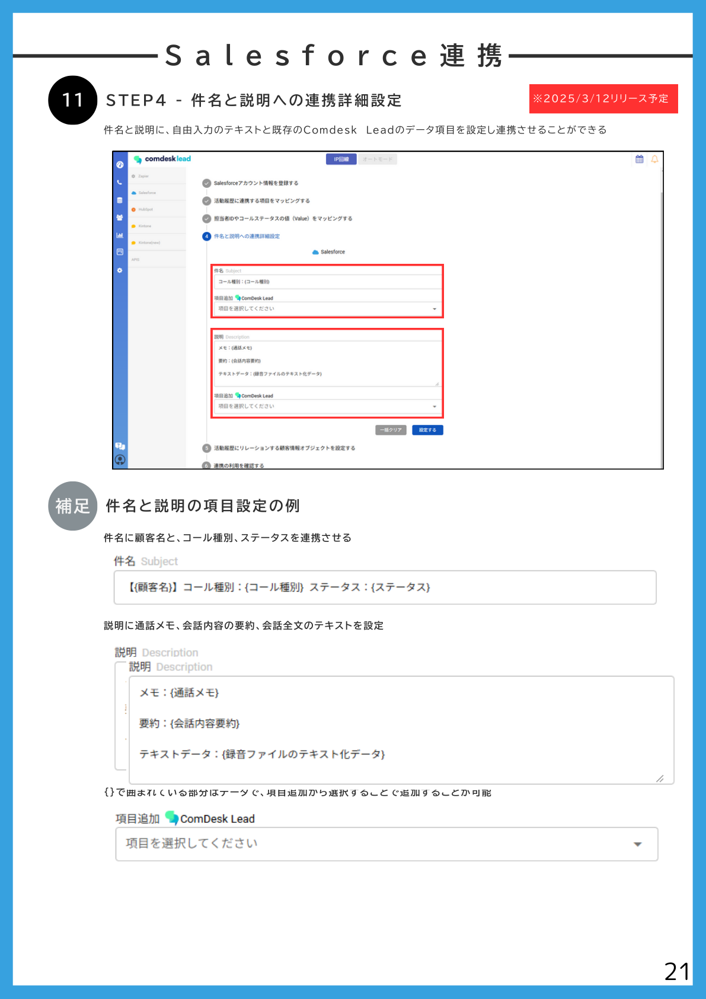

### 補足：件名と説明の項目設定の例

件名に顧客名と、コール種別、ステータスを連携させる例：

- **件名（Subject）**：`【(顧客名)】 コール種別：(コール種別) ステータス：(ステータス)`
- **説明（Description）**：通話メモ、会話内容の要約、会話全文のテキストを設定
  - メモ：`(通話メモ)`
  - 要約：`(会話内容要約)`
  - テキストデータ：`(録音ファイルのテキスト化データ)`

> `()` で囲まれている部分はデータで、項目追加から選択することで追加することができます。

### 補足：件名と説明への項目設定によるSalesforce上での見え方

- 件名に顧客名と、コール種別、ステータスを連携：左側のスレッドに、1Viewで表示されます。
- 説明に通話メモ、要約、テキストデータを連携：スレッド内に通話メモ、要約、テキストデータが表示されます。

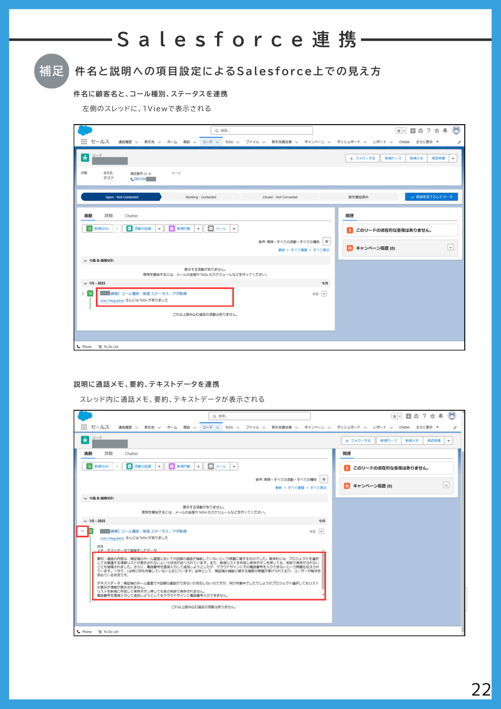

## STEP5 - リレーションする顧客情報オブジェクトの設定

Salesforceのどのオブジェクトに紐づけるかを設定します。

> ※2025/5/14リリース予定

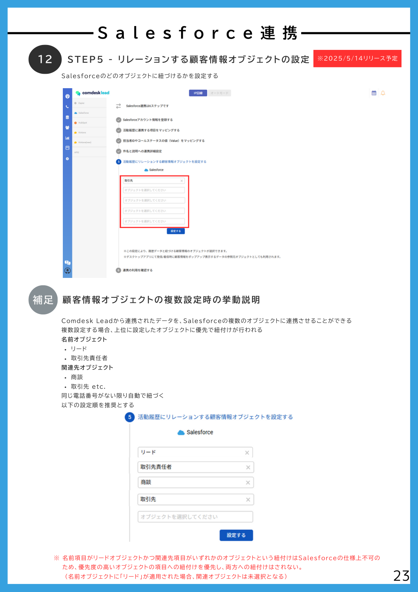

### 補足：顧客情報オブジェクトの複数設定時の挙動説明

Comdesk Leadから連携されたデータを、Salesforceの複数のオブジェクトに連携させることができます。複数設定する場合、上位に設定したオブジェクトに優先で紐付けが行われます。

- **名前オブジェクト**：リード／取引先責任者
- **関連先オブジェクト**：商談／取引先 など

同じ電話番号から取り込み自動で紐づく、以下の設定順を推奨とします。

1. リード
2. 取引先責任者
3. 商談
4. 取引先

> ※名前項目がリードオブジェクトかつ関連先項目がいずれかのオブジェクトという組付けはSalesforceの仕様上不可のため、優先度の高いオブジェクトの項目への組付けを優先し、両方への組付けはされない。（名前オブジェクトに「リード」が適用された場合、関連先オブジェクトは未設定となる）

### 補足：デスクトップアプリ利用時の連携先オブジェクトの選択について

【基本動作】同じリードオブジェクトに同じ電話番号がある場合、紐付け先を選択する。

※取引先に二つ同じ番号があるケース：デスクトップアプリの「通話内容記録」機能をONにすると切電後にSalesforceの紐付け先を選択することができる。同じ電話番号中の「オブジェクト名（名前）」がリストに表示され、選択して保存することで登録される。連携先で選択しているすべてのオブジェクトで同じ番号がないかの確認が行われる。

1. 関連先オブジェクトでそれぞれに同じ番号が二つずつある場合、デスクトップアプリでいずれかの紐付け先を選択する。
   - ※名前オブジェクト「リード」を選択せず、関連先オブジェクトを選択した場合、リードは設定されず取引先責任者に該当データがある場合、自動で取引先責任者が設定される。
2. 名前オブジェクトでそれぞれに同じ番号が二つずつある場合、デスクトップアプリでいずれかの紐付け先を選択する。
   - ※名前オブジェクトで「リード」を選択する時、Salesforceの仕様上関連先項目の設定は不可のため、名前項目オブジェクトに「リード」のみの設定となる。

### 補足：連携先オブジェクト全てで同じ番号があった時

名前オブジェクト（リード、取引先責任者）か関連先オブジェクト（取引先、商談）のいずれかにだけ紐付けがされます。

- 関連先オブジェクトの「取引先（名前A）」を選んだ場合、名前オブジェクトには紐付けされない。名前か関連先かのどちらか優先順が高い方を紐付ける。
- 名前オブジェクト、関連先オブジェクトに紐付く番号が一つだけの場合、自動で紐付けされる。
- 「名前オブジェクトがリードに紐づくかつ関連先も他オブジェクトに紐づく」というのがSF仕様上不可。

優先順位：

- 紐付け先の指定がある（デスクトップアプリで紐付け先選択）＞ インテグレーション設定のリレーション設定順（上ほど優先）の優先順
- 優先ではない方は紐付けしない

## 設定の保存・連携テストの実施

設定の保存、連携テストを実施します。連携テストを実施しなくても保存は可能です。

「保存する」または「連携テストを実施する」を押します。

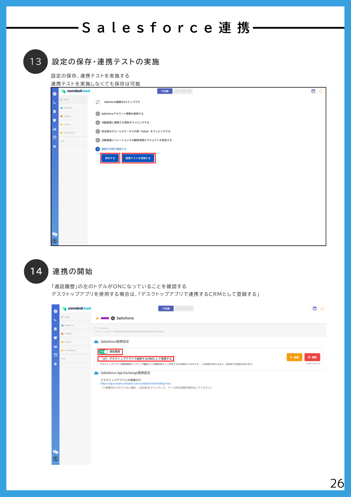

## 連携の開始

- 「通話履歴」の左のトグルがONになっていることを確認します。
- デスクトップアプリを使用する場合は、「デスクトップアプリで連携するCRMとして登録する」をONにします。

## 設定の削除

「削除」を押すと、削除の確認トーストが表示されます。トーストのOKを押すと設定が削除されます。

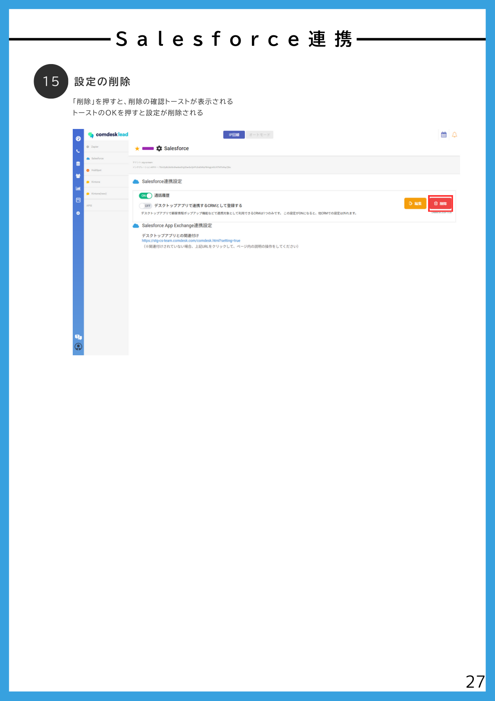

その他ご不明点などございましたら、[**サポートチームまでお問い合わせ**](#contact)をお願い致します。

お問い合わせ方法は\*\*[こちら](../../troubleshoot/support/12828937533081)\*\*
