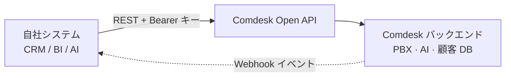

**Comdesk Lead Open API** を使うと、アプリケーションから Comdesk と直接やり取りできます。CRM・BI・チャット・AI ツールを開発する場合、発信の実行、通話履歴の取得（AI による文字起こし・要約を含む）、顧客の一括登録、リアルタイムな Webhook イベントの購読が可能です。すべて、API キーとスコープで保護された標準的な REST インターフェースで提供されます。

このドキュメントは、外部システムを Comdesk テナントに**連携する開発者**向けです。管理画面から API キーを発行・管理する方法については、ビジネス向けガイドブックを参照してください。

## できること

<CardGroup cols={2}>
  <Card title="クリックして発信" icon="phone">
    `POST /calls/initiate` で CRM から発信をトリガーします。
  </Card>

  <Card title="通話履歴の同期" icon="clock-rotate-left">
    完了した通話を取得・ストリーミング — メタデータ、メモ、文字起こし、AI 要約、音声分析、録音 URL。
  </Card>

  <Card title="顧客インポート" icon="users">
    単一または一括（最大 500 件）で顧客を登録。`external_id` で相互参照できます。
  </Card>

  <Card title="レポートと BI" icon="chart-line">
    Power BI・Tableau・Looker 向けに集計済みの通話統計を取得します。
  </Card>
</CardGroup>

## 仕組み



すべてのリクエストは API キーで認証され、そのキーに付与された**スコープ**で権限を確認し、テナント単位でレート制限を適用し、相関 ID `X-Request-ID` とともに記録されます。Comdesk は署名付き Webhook でイベントをあなたのエンドポイントに送信します。

## 前提条件

- `open_api` または `open_api_advanced` ライセンスを持つ Comdesk Lead テナント。
- テナント管理者が発行した API キー（[認証](/developer/ja/authentication) を参照）。
- Webhook を使う場合：`POST` リクエストを受信できる HTTPS エンドポイント。

<Note>
  Webhook、レポート API、カスタムレート制限、IVR トリガーは **`open_api_advanced`** ライセンスが必要です。プラン比較は [レート制限とクォータ](/developer/ja/rate-limits) を参照してください。
</Note>

## ベース URL

すべての v1 エンドポイントは次の配下で提供されます：

```text
https://app.comdesk.com/api/v1
```

<Warning>
  上記の本番ホストは Comdesk プラットフォームチームによる確認待ちです。本番稼働前に、ご利用環境の正確なベース URL をご確認ください。
</Warning>

## 次のステップ

<CardGroup cols={2}>
  <Card title="クイックスタート" icon="rocket" href="/developer/ja/quickstart">
    5 分で最初の認証付きリクエストを実行します。
  </Card>

  <Card title="認証" icon="key" href="/developer/ja/authentication">
    API キーの形式、Bearer ヘッダー、スコープ、IP 許可リスト。
  </Card>

  <Card title="API リファレンス" icon="code" href="/developer/ja/api-reference/calls">
    すべてのエンドポイント、パラメータ、レスポンスフィールド。
  </Card>

  <Card title="Webhook" icon="bell" href="/developer/ja/webhooks">
    イベントを購読し、署名を検証します。
  </Card>
</CardGroup>